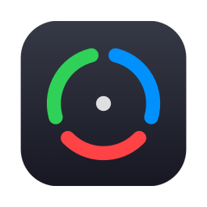

<p align="center">
  
</p>

<h1 align="center">OneBar</h1>

<p align="center">
  A free, open-source macOS menubar utility — clipboard history with OCR & QR superpowers,
  system monitoring, keyboard cleaning, and prevent-sleep. One icon, everything at hand.
</p>

<p align="center">
  
  
  
  
</p>

---

## Features

### 📋 Clipboard history
- **Unlimited text history** — automatically cleared when the Mac restarts; **pinned items survive everything**
- Keeps the last **20 images** (configurable), oldest evicted first
- **OCR on every image** (Apple Vision, fully on-device): screenshots become *searchable by the text inside them*
- **QR detection**: copy a QR code image and OneBar extracts the payload — copy it or open the link directly
- Filter chips (All / Text / Images / Links), pinned/recent sections, Spacebar full preview
- Ignored-apps list (copies from those apps are never recorded), and password-manager content is skipped automatically (`org.nspasteboard.ConcealedType`)
- Paste straight into the frontmost app — original or plain text

Keyboard-driven panel (every key remappable in Preferences):

| Key | Action |
| --- | --- |
| `⌘H` | Open clipboard history (global) |
| `S` | Focus search |
| `↑` `↓` | Navigate items / actions |
| `Enter` | Open the actions popup / run highlighted action |
| `O` / `P` | Paste original / paste plain text |
| `^V` | Paste plain text directly |
| `⌘Enter` | Open URL |
| `Space` | Full preview |
| `Tab` | Cycle filters |
| `Delete` | Delete item |

### 📊 System monitoring
- CPU / memory / disk rings in the popover with configurable warning & critical thresholds
- Hover a ring to morph it into the exact percentage
- Optional **live CPU + MEM readout right in the menubar**

### 🧽 Keyboard cleaning
- Blocks every key system-wide (yes, including `⌘Q`) behind a dimmed overlay while you wipe your keyboard — mouse-only exit plus an auto-exit countdown

### ☕ Prevent sleep
- "Temporary & safe": auto-released on quit, optional auto-off timer, and a separate menubar cup icon while active so you can't forget it

### 🔍 Scan Text / Scan QR
- Select any region of your screen and instantly get its **text (OCR)** or **QR payload** on the clipboard

## Install

Requires **macOS 26+** and Xcode command line tools.

```sh
git clone https://github.com/Babayev03/OneBar.git
cd OneBar
./build-app.sh
```

That builds a release binary, assembles `OneBar.app`, ad-hoc signs it, installs it to `/Applications`, and launches it.

### Permissions

macOS will ask for these on first use of the corresponding feature:

- **Accessibility** — required for keyboard cleaning and for pasting into other apps (System Settings → Privacy & Security → Accessibility)
- **Screen Recording** — required for Scan Text / Scan QR

Everything runs **100% on-device**. OneBar makes no network requests, ever.

## Preferences

- Launch on start
- Live menubar stats, update frequency, ring thresholds
- Image limit & optional history cap
- Ignored apps
- Fully remappable shortcuts
- Keyboard-cleaning duration, prevent-sleep auto-off, accent color

## License

[MIT](LICENSE) — do whatever you like, no warranty. Long live open source. 🖤
